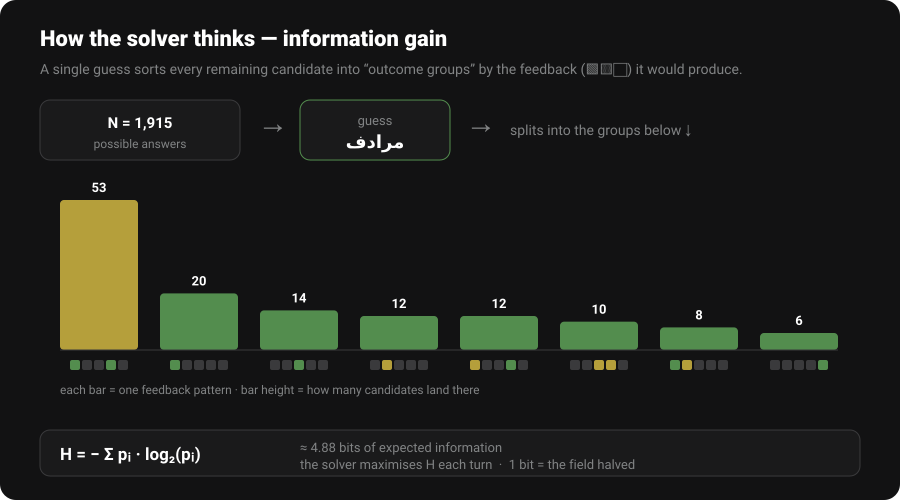

<div align="center">


**An information-theoretic solver for [AlWird](https://arwordle.netlify.app/) — the Arabic Wordle.**
Plays alongside you or by itself, ranks every guess by the *bits of information* it reveals, and visualises the whole thing with live, interactive charts.


</div>

---

## Table of contents

- [What is this?](#-what-is-this)
- [Quick start](#-quick-start)
- [Requirements](#-requirements)
- [The two interfaces](#-the-two-interfaces)
- [Modes explained](#-modes-explained)
- [The word pools & the two `.pkl` caches](#-the-word-pools--the-two-pkl-caches)
- [The information theory behind it](#-the-information-theory-behind-it)
- [The charts (web UI)](#-the-charts-web-ui)
- [Project structure](#-project-structure)
- [Rebuilding the caches](#-rebuilding-the-caches)
- [Configuration](#-configuration)
- [Troubleshooting](#-troubleshooting)
- [FAQ](#-faq)
- [Credits](#-credits)

---

## 🟩 What is this?

**AlWird** is the Arabic version of Wordle: guess a hidden **5-letter** Arabic word in **8** tries, with the familiar 🟩 green / 🟨 yellow / ⬜ gray feedback after each guess.

This project is a **solver** for that game. Instead of guessing by intuition, it treats each turn as a question and asks: *"Which guess, on average, tells me the most about the hidden word?"* That quantity is **entropy**, measured in **bits**, and the solver always plays (or recommends) the guess that maximises it.

It ships in two forms:

| | |
|---|---|
| 🖥️ **CLI** | A terminal menu. Zero third-party dependencies. |
| 🌐 **Web UI** | A Wordle-faithful browser app with live entropy charts, light/dark mode, and a responsive desktop/mobile layout. |

> [!NOTE]
> The solver never connects to the game or automates it. You play on the real site; the solver just advises you (interactive mode) or simulates games offline (automatic / benchmark modes).

---

## 🚀 Quick start

```bash
# 1. (optional) install the one web dependency
pip install -r requirements.txt

# 2a. run the terminal version
python3 alwird_solver.py

# 2b. or run the web version, then open http://127.0.0.1:5050
python3 app.py
```

That's it — the word lists and both opener caches are already included, so startup is instant.

---

## 📦 Requirements

- **Python 3.9 or newer** (`python3 --version` to check).
- **Flask ≥ 3.0** — *only* for the web UI. Install with `pip install -r requirements.txt`.
- **numpy** *(optional)* — only used by `setup_alwird.py` to rebuild caches faster. Not needed to run anything.

> [!TIP]
> The **CLI needs nothing but the Python standard library**. If you only want the terminal solver, you can skip `pip install` entirely.

---

## 🧭 The two interfaces

### Terminal (CLI)

```bash
python3 alwird_solver.py
```

A numbered menu. Type a top-level number (`1`–`6`) to open a submenu, or a shortcut like `1a`, `2b`, `3c` to jump straight in. Option **7** toggles the word pool (see [below](#-the-word-pools--the-two-pkl-caches)).

### Web UI

```bash
python3 app.py        # then open http://127.0.0.1:5050
```

A single-page app styled after Wordle's dark theme (with a light mode). Features:

- **Interactive play** with a clickable feedback grid and ranked suggestions.
- **Live charts** that update as you type a guess — before you even submit it.
- A **☀️/🌙 theme toggle** (top-left) that remembers your choice.
- A **responsive layout**: a single column on phones/tablets, and a wide two-pane layout on desktop that puts the charts (with explanations beside them) next to the game.

---

## 🎮 Modes explained

Every mode combines three independent choices: **what the solver does**, **how strict the guesses are**, and **how wide it searches**.

### 1. Interactive — *you play, the solver guides*
You play on the real site. After each turn you type your guess and click the tiles to match the colors you got. The solver filters the remaining candidates and shows you the top 5 guesses ranked by entropy.

### 2. Automatic — *the solver plays itself*
You give it the hidden answer; it simulates a full game against that word and shows the trace (every guess, its entropy, and how the candidate pool collapsed).

### 3. Benchmark — *measure the strategy*
It runs the solver against many random answers and reports the **average guesses**, **solve rate**, **worst case**, and a **distribution** of how often it solved in 1, 2, 3 … tries. This is how you objectively compare modes.

### Normal vs. Hard
| | |
|---|---|
| **Normal** | Any valid word may be guessed. |
| **Hard mode** | Every revealed hint must be reused — greens stay in place, yellows must reappear. Mirrors Wordle's "Hard Mode" rule. |

### Legacy
By default the solver only *searches* the current candidate set for its next guess (fast). **Legacy** mode instead scores **all ~120,000 valid words** every turn — slower, but it can occasionally find a sharper "probe" word that isn't itself a candidate.

> [!IMPORTANT]
> **Legacy is slow by design.** A benchmark in Legacy mode scores 120k words per turn, so keep the test count small. Normal mode is the everyday choice.

---

## 🗂️ The word pools & the two `.pkl` caches

Not every valid word can actually be the answer. The real game bundles **two** separate lists, and so does this solver:

| Pool | File | Size | Role |
|---|---|---|---|
| **Answers only** | `alwird_answers.json` | **1,915** | The words the game can actually pick as a solution. |
| **Full vocabulary** | `alwird_words.json` | **119,961** | Every word you're *allowed to type* (valid guesses). |

You switch between them with the **Word pool** toggle (web) or **menu option 7** (CLI):

- **Answers only** — the solver treats the hidden word as one of the 1,915 real answers. **Much faster and more accurate** (~3.85 average guesses).
- **Full vocabulary** — the solver assumes the answer could be any of the 120k words. Exhaustive, slower, and needs more guesses on average.

Each pool has its **own pre-computed opening-guess cache**, because the best first guess depends on which pool you're solving over:

| Cache file | Pairs with | Contents |
|---|---|---|
| `alwird_cache.pkl` | Full vocabulary | best openers scored over 119,961 words |
| `alwird_cache_answers.pkl` | Answers only | best openers scored over 1,915 words |

> [!WARNING]
> Don't rename or delete the `.pkl` files. They make startup instant — without them the solver would re-score every word at launch, which takes minutes. The toggle swaps **both** the candidate pool *and* the matching cache together.

---

## 🧠 The information theory behind it

<div align="center">



</div>

### The core idea

After some guesses, a set of **N** words could still be the answer. A candidate guess, when played, would produce some feedback pattern (like 🟩⬜⬜🟨⬜). Every remaining word would yield *exactly one* such pattern — so a guess **partitions** the N candidates into groups, one per possible pattern.

- A **bad** guess lumps most candidates into one big group → you learn little.
- A **great** guess spreads them into many small, even groups → whatever feedback you get, you've narrowed things down a lot.

The mathematical measure of "how much you expect to learn" is **Shannon entropy**:

```
        ┌
H(guess) = − Σ  p(pattern) · log₂ p(pattern)
        └  patterns
```

where `p(pattern)` is the fraction of candidates that fall into that pattern's group. The unit is **bits**. **One bit means you expect to cut the candidate pool in half.** The solver simply scores every allowed guess this way and picks the highest.

### A worked intuition

If a guess split 1,915 candidates into groups of sizes `{53, 20, 14, 12, …}`, the formula weighs each group by its probability and sums the surprise. A guess that splits them perfectly evenly into `2^k` equal groups would score exactly `k` bits — the theoretical ceiling for that turn is `log₂(N)` bits (the **Max** bar you see in the live chart).

### Two related numbers the UI shows

- **Expected remaining** = `Σ nᵢ² / N` — the average number of candidates you'll have left after this guess.
- **Words eliminated** = `N − expected_remaining` — the flip side: how many you expect to rule out.

### Why "answers only" wins

Entropy is computed *over the candidate set*. If that set is the 120k full vocabulary, the guess has to distinguish between tens of thousands of words that can never be the answer — wasted effort that inflates the guess count. Restricting candidates to the 1,915 real answers makes every bit count, which is why answers-mode averages **~3.85 guesses** versus the full pool's **~5.5**.

### The opening guess

The first guess is the same regardless of feedback (there's none yet), so its optimal value can be **pre-computed once and cached** — that's what the `.pkl` files hold: a pool of near-optimal openers within 0.5 bits of the best.

---

## 📊 The charts (web UI)

Every chart is an interactive bar chart — **hover any bar** to highlight it and read the exact value. Each one has a short explanation beside it.

| Chart | What it shows |
|---|---|
| **Your word vs best** | Live as you type: your guess's entropy vs. the solver's best vs. the theoretical max `log₂(N)`. |
| **How this guess splits the field** | The partition itself — one bar per feedback pattern, sized by how many candidates land there. This *is* the entropy, visualised. |
| **Candidates remaining** | The funnel: how the possible-answer pool collapses after each guess. |
| **Information gained per guess** | Bits actually gained each turn = `log₂(before ÷ after)`. |
| **Top suggestions — entropy** | The solver's ranking of the best guesses right now. |
| **Guesses-to-solve distribution** *(benchmark)* | How often it solved in 1, 2, 3 … guesses. |
| **Avg candidates by attempt** *(benchmark)* | Averaged collapse curve across all tested words. |

---

## 📁 Project structure

```
v5/
├── alwird_solver.py          # core solver + CLI menu  (stdlib only)
├── app.py                    # Flask web backend
├── templates/
│   └── index.html            # the entire web UI (HTML + CSS + JS, inlined)
│
├── alwird_words.json         # full vocabulary — 119,961 valid guesses
├── alwird_answers.json       # answer words   — 1,915 real solutions
├── alwird_cache.pkl          # opener cache for the FULL pool
├── alwird_cache_answers.pkl  # opener cache for the ANSWERS pool
│
├── setup_alwird.py           # (optional) re-download words + rebuild caches
├── requirements.txt          # pip dependencies (just Flask)
├── docs/                     # README visuals
└── README.md                 # this file
```

### How the pieces fit

- `alwird_solver.py` holds all the math (`compute_pattern`, `compute_entropy`, `filter_candidates`, the opener builder) and is imported by both the CLI and the web app.
- `app.py` wraps the solver in a Flask server, runs slow computations in **background threads** with a **multiprocessing pool**, and streams progress to the browser via polling.
- `index.html` is fully self-contained — no build step, no external JS libraries. The charts are hand-rolled SVG.

---

## 🔧 Rebuilding the caches

The shipped `.pkl` files already work. You only need this if you want to refresh the word list from the live site or regenerate the caches from scratch:

```bash
pip install numpy        # optional, ~10× faster
python3 setup_alwird.py
```

`setup_alwird.py` is tuned for multi-core CPUs (it parallelises the opener scoring and, if numpy is present, vectorises the entropy computation). It re-downloads `alwird_words.json` and rebuilds the **full-pool** cache.

---

## ⚙️ Configuration

**Change the port** — edit the last line of `app.py`:

```python
app.run(host="127.0.0.1", port=5050, debug=False, use_reloader=False)
```

**View it on your phone** (same Wi-Fi) — change the host to `0.0.0.0`:

```python
app.run(host="0.0.0.0", port=5050, debug=False, use_reloader=False)
```

Then on your phone browse to `http://<your-computer-ip>:5050`
(find the IP with `ipconfig getifaddr en0` on macOS, or `hostname -I` on Linux).

**See the mobile layout on desktop** — just narrow the browser window below ~1024px, or use the browser's device toolbar (`Ctrl/Cmd+Shift+M` in Chrome).

---

## 🛠️ Troubleshooting

<details>
<summary><b>The web page says "Network error" / won't load</b></summary>

The server isn't running, or you started it in a different terminal/sandbox than the browser can reach. Run `python3 app.py` yourself from a normal terminal and open the printed URL (`http://127.0.0.1:5050`).
</details>

<details>
<summary><b>I edited <code>index.html</code> (or the CSS/JS) but nothing changed</b></summary>

Flask caches the compiled template in memory because `debug=False`. **Restart the server** (`Ctrl+C`, then `python3 app.py` again). A plain browser refresh is not enough.
</details>

<details>
<summary><b>"Address already in use" / "Port 5050 is in use"</b></summary>

A previous server is still running. Stop it, or free the port:

```bash
# macOS / Linux
lsof -ti tcp:5050 | xargs kill -9
```
Then start again. Or change the port in `app.py`.
</details>

<details>
<summary><b>"Word list not found" on startup</b></summary>

`alwird_words.json` must be in the same folder as the scripts. It ships with the project — if it's missing, run `python3 setup_alwird.py` to re-download it.
</details>

<details>
<summary><b>The Answers toggle says the cache or list is missing</b></summary>

Answers mode needs both `alwird_answers.json` and `alwird_cache_answers.pkl` in the folder. They ship with the project; don't move or rename them.
</details>

<details>
<summary><b>Legacy mode / a big benchmark is extremely slow</b></summary>

That's expected — Legacy scores all ~120,000 words every turn. Use a small test count, or switch to Normal mode and the Answers pool for fast, accurate results.
</details>

<details>
<summary><b>Arabic letters look reversed or broken</b></summary>

The UI sets `direction: rtl` on the tiles so Arabic reads right-to-left, and loads Noto Sans Arabic from Google Fonts. If letters look wrong, you're likely offline (font didn't load) — the app still works, it just falls back to a system Arabic font.
</details>

---

## ❓ FAQ

**Does it cheat / read the game?**
No. It has no connection to the site. You report the feedback yourself, or you tell it the answer for a simulation.

**Why isn't every 120k word a valid answer?**
The game distinguishes *valid guesses* (120k) from *actual answers* (1,915). A word like `نتريا` is an allowed guess but never a solution. The solver respects that split via the word-pool toggle.

**What's the best opener?**
It varies per run (the solver samples from a pool of near-optimal openers) and depends on the pool. The cache holds every opener within 0.5 bits of the theoretical best.

**Can I use it for English Wordle?**
The math is identical, but the word lists and Arabic normalisation are AlWird-specific. You'd need to swap the JSON word lists.

---

## 🙏 Credits

- The game: **[AlWird](https://arwordle.netlify.app/)** (Arabic Wordle).
- The approach is the classic **information-theoretic Wordle strategy** — maximising expected entropy per guess.
- Arabic normalisation keeps أ / إ / آ / ا distinct and strips only diacritics, matching how the game treats letters.

<div align="center">

*Made for solving — and for seeing the information theory while you do it.* 🟩🟨⬜

</div>
